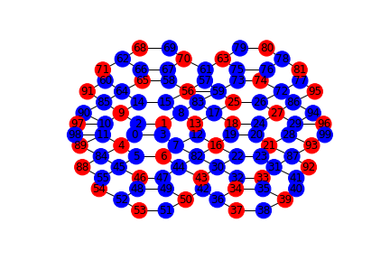
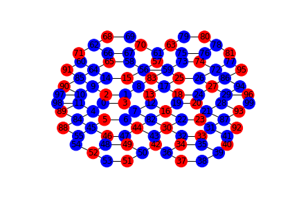
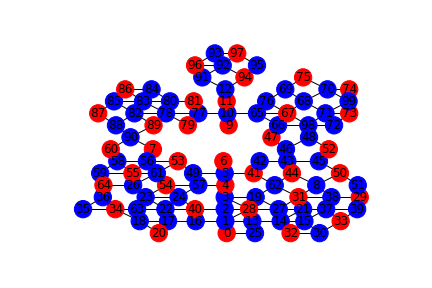
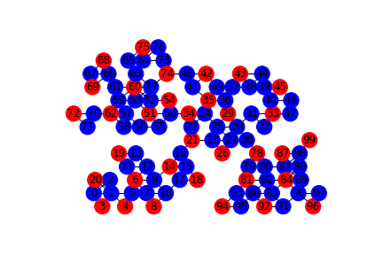

# Modularized Sharp Networks for State Preparation into MIS
QuEra Challenge, iQuHACK 2023

QuEra Yale University Team
Members: Alex Deters, Ben McDonough, Pranav Parakh, Sofia Fausone, Wyatt Kremer

## Contents

[TOC]

## Theoretical Motivation

QuEra Aquila is a 256-qubit quantum processor realized as a programmable array of optically-trapped ultracold $Rb$ atoms. Aquila belongs to the class of neutral atom hardware platforms. A two-level system is established by identifying the ground state $\ket{0}$ and excited "Rydberg" state $\ket{1}$ of a neutral $Rb$ atom with the electron configurations $[Kr]\space5s^1$ and $[Kr]\space70s^1$, respectively. The Gaussian laser beams that trap the arrays of $Rb$ atoms may be used to drive time-dependent Rabi oscillations $\Omega(t)$ with induced relative phase $e^{2i\phi(t)}$ and introduce a *global* time-dependent Rydberg detuning $\Delta(t)$. The global nature of $\Delta(t)$ imposed by the hardware inherently prevents the *direct* preparation of the $i$th atom in the Rydberg state $\ket{1_i}$. Therefore, it is necessary to place the atoms on the 75 $\mu m$ by 76 $\mu m$ processor in such a way that the geometry and interatomic interactions, which govern the time evolution of the system, would bring an initial uniform state to any given state. It is this sense that a state can be *indirectly* prepared to have the $i$th atom in the Rydberg state $\ket{1_i}$. 

The Hamiltonian for the array of $N\space Rb$ atoms is given as:

$\frac{H}{\hbar}=\sum_i{\Omega (t)(e^{i\phi(t)}\ket{0_i}\bra{1_i}+e^{-i\phi(t)}\ket{1_i}\bra{0_i})}-\Delta(t)\sum_i{\hat{n_i}}+\sum_{i<j}{V_{ij}\hat{n_i}\hat{n_j}}$,

where $\ket{0_i}$ and $\ket{1_i}$ are the ground and Rydberg states for atoms $i=1,2,...,N$, $\hat{n_i}=\ket{1_i}\bra{1_i}$ is the projection operator onto the Rydberg state $\ket{1_i}$, and the interatomic interaction potential is of the form $V_{ij}=\frac{C_6}{|\vec{r_i}-\vec{r_j}|^6}$ with characteristic interaction energy  $C_6 =5.42\cdot10^{-24}$ (working in natural units with $\hbar=1$ such that energy may be expressed in terms of frequency). The natural characteristic distance $R=(\frac{C_6}{\Delta_{max}})^{1/6}$ is called the unit disk radius. Suppose atoms $i,j$ are in their respective Rydberg states $\ket{1_i},\ket{1_j}$ and have separation distance $|\vec{r_i}-\vec{r_j}|<R$.  Then the interaction potential $V_{ij}=\frac{C_6}{|\vec{r_i}-\vec{r_j}|^6}\gg\Delta_{max}$ , demonstrating that a large repulsive interaction cannot be overcome by atom-field coupling in such close proximity. The notion of  the **Rydberg blockade** is simply the tendency for atoms to not simultaneous occupy Rydberg states at distance scales $L\lesssim R$ . It is notable that the potential $V_{ij}=\frac{C_6}{|\vec{r_i}-\vec{r_j}|^6}$ has an interaction tail; even for separation distances $|\vec{r_i}-\vec{r_j}|>R$, $V_{ij}$ does not vanish despite being very small as shown in the figure below.

**Figure 1:**  The neighborhood around an inverse sextic potential $V\propto\frac{1}{|\vec{r}|^6}$

## Exploiting the Interaction Tail with Tail Graph Feature

|                            Graph                             |                                                              |
| :----------------------------------------------------------: | :----------------------------------------------------------: |
|  |  |
|  |  |
|  |  |
|                                                              |                                                              |

In the top figure, we present a graph with a well defined maximum indepndent set, which was run through the classical simulator and produced the expected value. 
We decided to simulate and run a modular graph that can be "stitched" together with other graphs in order to create larger maximum independent sets. This required us to be able to control the edge node behaviour of our modular pieces in order to put them together while minimally affecting the maximum independent sets. Our inital idea was to do this through selective detuning of certain atoms that occured on the edge of our graph. Working within the hardware constraints, we realized that was not possible, and so set out to create a different way to be able to selectively influence edge-atom state behaviour. 

There interaction potential in the Hamiltonian is determined by a constant interaction energy, $C_6$, and decreases as the inverse of the separation distance to the sixth power. To an approximation, this means that only atoms within the unit disk radius influence each other. Atoms on the exterior of the graph (those with a small degree), are more likely to be in a Rydberg state. The atoms on the exterior of the graph experience a lower potential penalty when in a Rydberg state, influencing them to be in a Rydberg state with a high probability. Even without the advantage of selective detuning, we realized that by connecting external atoms to atoms we wanted to influence, we could influence their initial state.
In the above figure, we present a graph that whose vertices we change from their default state by using the external node (tail) strategy described above. in the top row, we present a graph with a well defined maximum indepndent set, which was run through the classical simulator and produced the expected value. In the second row, we attempted to change the "4" node from the first graph from the ground state to the Rydberg state. We did this by connecting three two-node tails to this node. The external most node of these tails was generally in the Rydberg state, forcing the second node to be more often in the ground state. This in turn successfully increased the probability that the "4" state was in the Rydberg state, from 0 to about 50%. In the bottom-most row, we tried to use tails to change the "1" node from the Rydberg state into the ground state. By attaching two single-node tails to the "1" node, we effectively changed it from being in the Rydberg state 100% of the time to being in the ground state 100% of the time, controlling the atom.

**Figure 2:** **Rydberg-Tail Selective State Initialization**
Background: 

In the top figure, we present a graph with a well defined maximum indepndent set, which was run through the classical simulator and produced the expected value. 

## Analysis of the $(N,\lambda)$ Regular Polyhedron Junction

Suppose that $N$ unit disks are to be brought as close as possible under the constraint that the centers of the disks must always  define the vertices of a regular polygon of $N$ sides. This can be accomplished by considering the set of points

$\set{\lambda cos(\frac{2\pi k}{N}),\lambda sin(\frac{2\pi k}{N})\space|\space k\in\set{0,1,...,N-1}}$ where $\lambda$ is a scalar multiple equal to the new radii of the disks under a dilation by the factor $\lambda$. We wish to find the largest integer $N$ such that there is a $\lambda<1$ such that all disks enclose exactly one center.

By the Law of Cosines, the distance separating the centers of a pair of adjacent disks after a dilation by factor $\lambda$ is given as

$d(N)=\sqrt{\lambda^2+\lambda^2-2(\lambda)(\lambda)\cos(\frac{2\pi}{N})}=\sqrt{2\lambda^2(1-\cos(\frac{2\pi}{N})}=\lambda\sqrt{2(1-\cos(\frac{2\pi}{N})}$

and requiring that $d(N)\geq1$ yields

$\lambda(N)\geq\frac{1}{\sqrt{2(1-cos(\frac{2\pi}{N})}}$. It immediately follows that if $\lambda=\lambda_{min}(N)=\frac{1}{\sqrt{2(1-cos(\frac{2\pi}{N})}}$, the distance between the centers of adjacent disks is exactly $1$. Since $\lambda_{min}(N)=\frac{1}{\sqrt{2(1-cos(\frac{2\pi}{N})}}$ is monotonically increasing for integers $i\geq1$

|  |  |
| ---------------------------------- | -------------------------------------------------- |
|  |                  |

**Figure 3:** Regular polyhedron junctions for $(N,\lambda)=(4,1),(5,1),(5,\lambda_{min}(5)),(6,1)$

## GraphFactory: Design and test unit graphs

To easily design, test, and visualize unit disk graphs, we created software written in Processing which allows a user to design unit disk graphs and export them as lists. This software was the engine that drove our creative exploration of many different types of graphs, which we discuss below. The features of the software include the following:
* creating, dragging, and deleting nodes
* displaying the Rydberg Blockade distance
* automatically representing connections between adjacent nodes
* displaying the physical spatial restrictions of the QuERA Aquila processor to 75 x 76 $\mu$m
* producing a warning if two atoms are positioned closer than the 4$\mu$m resolution of the laser.
* Aligning the atoms on the y-axis to be spaced in increments of $4\mu$m.

    

## Using GraphFactory to Make & Test Graphs

GraphFactor tool enables user-friendly building of unit-disk graphs that can be sent to run on Aquila. The code, run on Processing, highlights appopriate distances between nodes. Any possibilities larger than the Blockade radius while remaining in a unit disk will be shown with a black connection. Distances smaller than the Blockade radii will be connected in red, signalling the user to move their node. There is an option to display all unit disks at once to visualize graph creation, or to hide these unless actively moving the cursor. In preliminary iterations of the tool, we composed graphs with varying x and y positions as displayed below: 

|  |
|  |

We encountered errors related to a minimum y-coordinate separation, due to the laser architecture of the machine. To fix this, we modified GraphFactory to only plot particular y-separations, using a row formation. With this feature, drawn points will be set to the nearest y-coordinate allowed. Below are adjusted graphs of interest: 

| 5 Flower |  Inverted 5 Flower|
| :----------------------------------------------------------: | :------------------------------------------------------: |
| Inverted Tree| Tree|

Motivation: We were interested in comparing graph structures based on tail versus edge graph endings. Our initial idea was that the more tail-endings we could include, the more state 0 nodes we'd observe. To test this against the reverse case - graphs with many more edge-endings - we constructed variations on a 16-node 'flower object', shown below. We also tested examples of tree-like and inverted-tree graphs, all modified simply by cursor movements in GraphFactor. 

## Pulse Optimization 

In the end, our attempts at pulse optimization failed to yield results better than the default pulse shapes used in the tutorials. We tried these pulses on a small number of qubits in simulation. We first tried a Gaussian pulse, and we found that the Gaussian pulse nearly always excited the state outside of the lowest energy eigenspace. The Gaussian waveform chosen was
$$
\Omega_{gaussian}(t)= A e^{-(x^2-\tau/2)/(2\sigma^2)}
$$
And the optimization was carried out over $\tau, A,$ and $\sigma$. Next, we tried the cardinal sine function. This produced better results then the Gaussian, which we attributed to a larger area and a softer peak. The waveform chosen for the sinc drive was
$$
\Omega_{sinc}(t)=a\text{sinc}^2(\frac{\omega t}{2}-\pi)/(\omega), t\ge0
$$
 where $${f}(t) = \cases{{\text{sinc}^2}(t)&$,t\le0$\cr1&$,t>0$}$$  and the maximum amplitude $a$ and radial frequency $\omega$ are parameters to be determined.

## Post Processing

In many cases, after the adiabatic algorithm is completed, the graph will have converged to an invalid solution due to the inherent stochastic nature of the process. In these cases, however, we do not necessarily need to discard the shot. Although we may not have reached a maximally independent set, it is still likely that the algorithm will have converged towards some sort of low energy minima. To this end we introduce a classical postprocessing algorithm, which takes an incomplete result, and attempts to patch it.

The algorithm consists of three main steps:

1. Find any instances of two adjacent Rydberg states on the graph, and set both of them to ground.
2. Find every ground state that could become Rydberg without violating the independence condition.
3. Iterate through all combinations of replacing ground states with Rydberg until an MIS solution is found.

It is important to note that this algorithm is $O(2^n)$ where $n$ is the number of ground states that have the potential to be Rydberg. Therefore for large graphs it has the potential to take an immensely long time, and so we place a cut-off dependent on the number of potentially excitable states. We choose this to be $20$ to find MIS solutions in nearly all cases while still taking fewer than a couple seconds.

## Using Rydberg Tails to Enforce Boundary Conditions
In this project, one class of graphs we explored concerns many real-world examples, such as the organization of human and animal populations, transportation, and stock portfolios, where there is a high degree of clumping among clusters in the graph and sparse connectivity between clusters. We realized that if we were able to impose boundary conditions on graphs, we could effectively split them up and solve them separately, and then stich the solutions together at the end. This would introduce a linear time complexity, which could theoretically be lower given the lower samples required to obtain accurate results from smaller graphs.

The constraints of the hardware would not allow us to prepare individual qubit states directly via local detunings or coupling to the environment. We realized through experimentation on simpler models and modeling in qutip that the smooth decay of the Rydberg interaction potential leads to a lower "energy penalty" for excited states at the exterior of the lattice in comparison with atoms that order higher than one. This causes the Rydberg states in qubits at the exterior of the lattice to be heaevily favored. We used this by engineering "tails" of length one or two to force a desired atom into the ground state or the excited state with high probability. 

We constructed a graph that satisfies this criterion. We were able to obtain results with the correct boundary conditions with high probability. The example below shows one of four sections of a clustered graph, with tails added to fix the atom labeled "zero" in the ground state.

|  | [notails](../data/cluster2_no_tails_filled.png) |

## Graphs

|        |  |
| :----------------------------------------------------------: | :------------------------------------------------------: |
|                         hyperflower1                         |                      hyperflower50                       |
|  |              |
|                 more_connected_inverted_tree                 |                         big_ben                          |
|          |                                                          |
|                         five_flower                          |                                                          |

## Results

**Name**|**Shots**|**Best**|**Most Frequent**|**Intractibility Rate**|**EV**
:-----:|:-----:|:-----:|:-----:|:-----:|:-----:
Hyperflower|50|42|37|0.08|37.48
Big Ben|50|37|34|0.08|33.89
Five Flower|50|38|33|0|37.69
More Connected Inverted Tree|50|39|36|0.06|38.09
Hyperflower|1|36|36|0|36

## Sources

https://www.quera.com/aquila

https://github.com/iQuHACK/2023_QuEra
