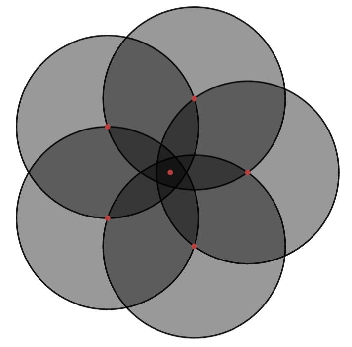

# Modularized Sharp Networks for State Preparation into MIS
QuEra Challenge, iQuHACK 2023

QuEra Yale University Team
Members: Alex Deters, Ben McDonough, Pranav Parakh, Sofia Fausone, Wyatt Kremer

## Contents

- [Modularized Sharp Networks for State Preparation into MIS](#modularized-sharp-networks-for-state-preparation-into-mis)
  - [Contents](#contents)
  - [Theoretical Motivation](#theoretical-motivation)
  - [Exploiting the Interaction Tail with Tail Graph Feature](#exploiting-the-interaction-tail-with-tail-graph-feature)
  - [Analysis of the $(N,\lambda)$ Regular Polyhedron Junction](#analysis-of-the-nlambda-regular-polyhedron-junction)
  - [Graph Factory, a Companion for Designing Unit Disk Graphs](#graph-factory-a-companion-for-designing-unit-disk-graphs)
  - [Using GraphFactor to Make + Test Graphs](#using-graphfactor-to-make--test-graphs)
  - [Pulse Optimization ](#pulse-optimization-)
  - [Post Processing](#post-processing)
  - [Sources](#sources)

## Theoretical Motivation

QuEra Aquila is a 256-qubit quantum processor realized as a programmable array of optically-trapped ultracold $Rb$ atoms. Aquila belongs to the class of neutral atom hardware platforms. A two-level system is established by identifying the ground state $\ket{0}$ and excited "Rydberg" state $\ket{1}$ of a neutral $Rb$ atom with the electron configurations $[Kr]\space5s^1$ and $[Kr]\space70s^1$, respectively. The Gaussian laser beams that trap the arrays of $Rb$ atoms may be used to drive time-dependent Rabi oscillations $\Omega(t)$ with induced relative phase $e^{2i\phi(t)}$ and introduce a *global* time-dependent Rydberg detuning $\Delta(t)$. The global nature of $\Delta(t)$ imposed by the hardware inherently prevents the *direct* preparation of the $i$th atom in the Rydberg state $\ket{1_i}$. Therefore, it is necessary to place the atoms on the 75 $\mu m$ by 76 $\mu m$ processor in such a way that the geometry and interatomic interactions, which govern the time evolution of the system, would bring an initial uniform state to any given state. It is this sense that a state can be *indirectly* prepared to have the $i$th atom in the Rydberg state $\ket{1_i}$. 

The Hamiltonian for the array of $N\space Rb$ atoms is given as:

$\frac{H}{\hbar}=\sum_i{\Omega (t)(e^{i\phi(t)}\ket{0_i}\bra{1_i}+e^{-i\phi(t)}\ket{1_i}\bra{0_i})}-\Delta(t)\sum_i{\hat{n_i}}+\sum_{i<j}{V_{ij}\hat{n_i}\hat{n_j}}$,

where $\ket{0_i}$ and $\ket{1_i}$ are the ground and Rydberg states for atoms $i=1,2,...,N$, $\hat{n_i}=\ket{1_i}\bra{1_i}$ is the projection operator onto the Rydberg state $\ket{1_i}$, and the interatomic interaction potential is of the form $V_{ij}=\frac{C_6}{|\vec{r_i}-\vec{r_j}|^6}$ with characteristic interaction energy  $C_6 =5.42\cdot10^{-24}$ (working in natural units with $\hbar=1$ such that energy may be expressed in terms of frequency). The natural characteristic distance $R=(\frac{C_6}{\Delta_{max}})^{1/6}$ is called the unit disk radius. Suppose atoms $i,j$ are in their respective Rydberg states $\ket{1_i},\ket{1_j}$ and have separation distance $|\vec{r_i}-\vec{r_j}|<R$.  Then the interaction potential $V_{ij}=\frac{C_6}{|\vec{r_i}-\vec{r_j}|^6}\gg\Delta_{max}$ , demonstrating that a large repulsive interaction cannot be overcome by atom-field coupling in such close proximity. The notion of  the **Rydberg blockade** is simply the tendency for atoms to not simultaneous occupy Rydberg states at distance scales $L\lesssim R$ . It is notable that the potential $V_{ij}=\frac{C_6}{|\vec{r_i}-\vec{r_j}|^6}$ has an interaction tail; even for separation distances $|\vec{r_i}-\vec{r_j}|>R$, $V_{ij}$ does not vanish despite being very small as shown in the figure below.

**Figure 1:**  The neighborhood around an inverse sextic potential $V\propto\frac{1}{|\vec{r}|^6}$

## Exploiting the Interaction Tail with Tail Graph Feature

|                            Graph                             |                                                              |
| :----------------------------------------------------------: | :----------------------------------------------------------: |
|  |  |
|  |  |
|  |  |
|                                                              |                                                              |

**Figure 2:** Rydberg-Tail Selective State Initialization
Background: 

In the top figure, we present a graph with a well defined maximum indepndent set, which was run through the classical simulator and produced the expected value. 

## Analysis of the $(N,\lambda)$ Regular Polyhedron Junction

<<<<<<< HEAD
Suppose that $N\geq 2$ unit disks are to be brought as close as possible under the constraint that the centers of the disks must always define the vertices of a regular polygon of $N$ sides. This can be accomplished by considering the set of points
=======
Suppose that $N$ unit disks are to be brought as close as possible under the constraint that the centers of the disks must always  define the vertices of a regular polygon of $N$ sides. This can be accomplished by considering the set of points
>>>>>>> 38ea6e71404f64db66303616ef1e84c5cc8d07eb

$\set{\lambda cos(\frac{2\pi k}{N}),\lambda sin(\frac{2\pi k}{N})\space|\space k\in\set{0,1,...,N-1}}$ where $\lambda$ is a scalar multiple equal to the new radii of the disks under a dilation by the factor $\lambda$. We wish to find the largest integer $N$ such that there is a $\lambda<1$ such that all disks enclose exactly one center.

By the Law of Cosines, the distance separating the centers of a pair of adjacent disks after a dilation by factor $\lambda$ is given as

$d(N)=\sqrt{\lambda^2+\lambda^2-2(\lambda)(\lambda)\cos(\frac{2\pi}{N})}=\sqrt{2\lambda^2(1-\cos(\frac{2\pi}{N})}=\lambda\sqrt{2(1-\cos(\frac{2\pi}{N})}$

and requiring that $d(N)\geq1$ yields

<<<<<<< HEAD
$\lambda(N)\geq\frac{1}{\sqrt{2(1-cos(\frac{2\pi}{N})}}$. Therefore, $\lambda_{min}(N)=\frac{1}{\sqrt{2(1-cos(\frac{2\pi}{N})}}$ gives the minimum value of $\lambda$ that guarantees that all disks enclose exactly one center, and if $\lambda_{min}(N)\geq1$, there are necessarily no $\lambda<1$ such that all disks enclose exactly one center. If there is some $\lambda<1$ such that all disks enclose exactly one center, it must be the case that $\lambda_{min}<1$. Since $\lambda_{min}(N)=\frac{1}{\sqrt{2(1-cos(\frac{2\pi}{N})}}$ is a monotonically increasing function for all integers $N\geq2$ and $\lambda_{min}(5)\approx0.8507$

|  |  |
| ---------------------------------- | -------------------------------------------------- |
|  |                  |

**Figure 3:** Regular polyhedron junctions for $(N,\lambda)=(4,1),(5,1),(5,\lambda_{min}(5)),(6,1)$

## Graph Factory, a Companion for Designing Unit Disk Graphs

Exact alignment of y is going to be necessary

## Using GraphFactor to Make + Test Graphs

GraphFactor tool enables user-friendly building of unit-disk graphs that can be sent to run on Aquila. The code, run on Processing, highlights appopriate distances between nodes. Any possibilities larger than the Blockade radius while remaining in a unit disk will be shown with a black connection. Distances smaller than the Blockade radii will be connected in red, signalling the user to move their node. There is an option to display all unit disks at once to visualize graph creation, or to hide these unless actively moving the cursor. In preliminary iterations of the tool, we composed graphs with varying x and y positions as displayed below: 
|  |  |
| ---------------------------------- | -------------------------------------------------- |
|  |                  |
Motivation: We were interested in comparing graph structures based on tail versus edge graph endings. Our initial idea was that the more tail-endings we could include, the more state 0 nodes we'd observe. To test this against the reverse case - graphs with many more edge-endings - we constructed variations on a 16-node 'flower object', shown below. We also tested examples of tree-like and inverted-tree graphs, all modified simply by cursor movements in GraphFactor. 

## Pulse Optimization 

Denote the sine cardinal function as $${sinc}(t) = \cases{\frac{\sin(t)}{t}&$,t\neq0$\cr1&$,t=0$}$$.

Then consider the wave profile $p_{sinc}(t)=af(\frac{\omega t}{2}-\pi), t\ge0$,

 where $${f}(t) = \cases{{sinc^2}(t)&$,t\le0$\cr1&$,t>0$}$$  and the maximum amplitude $a$ and radial frequency $\omega$ are parameters to be determined.

Gaussian pulse: $p_{gaussian}(t)=e^{-x^2}$

Logistic?: $p_{logistic}(t)=\frac{A}{1+Be^{-Cx}}$

## Post Processing

22 unextractable for big_ben

## Sources

https://www.quera.com/aquila

https://github.com/iQuHACK/2023_QuEra
