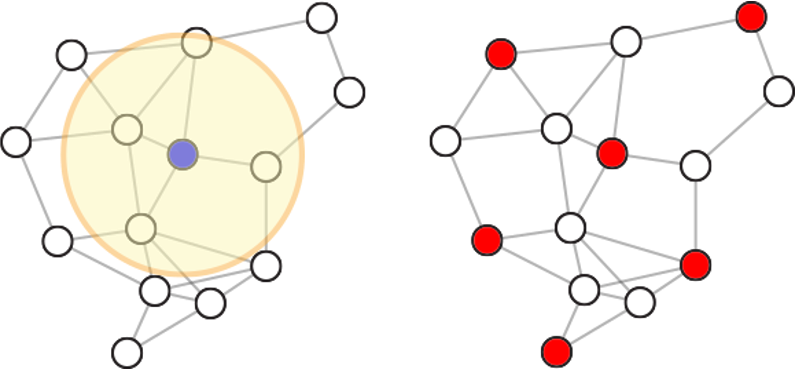

# Rydberg Blockade

As we had discussed in the tutorial, one of the most useful phenomena of the Rydberg atom platform is the Blockade effect, e.g., the idea that if atoms are too close together, the probability of exciting both atoms into the Rydberg state is quite small. 

The most natural application of the Rydberg blockade is the Maximum Independent Set (MIS) problem on unit-disk graphs. The mapping between the atom positions and the unit-disk graph is related to the Blockade radius. If atoms represent nodes and those two atoms are within the blockade radius of one another, the effective graph would have an edge between the nodes represented by their respective atoms. For a large positive detuning, this implies that the lowest energy state of the rydberg system will encode the solution to the MIS. 

# Adiabatic state preparation

Another concept we discussed was the notion of adiabatic state preparation. The idea is to slowly sweep the detuning of the rydberg system from negative to positive. The quantum adiabatic theorem states the system will remain in the lowest energy state, allowing us to, in theory, prepare the MIS using the Rydberg Blockade. That only applies to protocols with vanishing velocities. As we saw during the tutorial when trying to obtain the MIS on the defective King's graph, we found that for finite time sweeps, some shots are only sometimes the MIS. In some cases, the configuration of Rydberg atoms does not form an independent set. 

Fortunately, there are ways to improve upon the adiabatic sweep. We have a separate document, `quantum_state_prep.md`, that discusses some of these concepts with references. This is a vibrant field with much active research, so feel free to dig a bit into the literature.

# iQuHack Challenge:

The challenge will allow you to explore the concept of the Rydberg blockade and independent sets, and quantum state preparation. The problem is as follows:

Create an algorithm that finds the largest independent set (IS) using the smallest number of shots. The computing protocol is the core of the challenge, but a catch is that your chosen graph is also up to you. You can pick any unit disk graph that can be run on Aquila with up to 100 atoms.

To be clear, in this challenge, you want to maximize the total number of nodes in your IS. You do not get credit for maximizing the fraction of nodes. For example, an IS on one graph with 20 out of 100 nodes wins over an IS with 7 out of 10 nodes.

The criteria for a valid IS and graph are as follows:

1. The graph must be encoded using the atom positions, e.g., each atom must correspond to the node of the target graph. 

2. We only accept single-component connected graphs. The unit disk graph will be determined by the unit disk radius, which is set by the final detuning value, $\Delta$ using: $ R = \left(\frac{C_6}{\Delta}\right)^{1/6}$. 

3. The Rydberg state will denote whether an atom/node belongs to the IS for a given shot. Atoms will sometimes not get sorted correctly, resulting in a missing atom. You can keep the IS obtained from that shot as is. 

4. shots can be post-processed to transform them into a valid IS; however, the total size of the set must be less than or equal to the original set. 

### Judging Criteria
You will be judged based on the following (in no particular order):

1. The size of the IS (more is better)
2. The number of shots runs on the QPU  (less is better)
3. The creativity of the graph design
4. The creativity of the pulse design

We acknowledge that there is a certain amount of luck in this challenge. As such, we will put a higher weight on the creativity of a particular solution. 

We provided a function `plot_task_results(...)` in the `iquhack_utils.py` file in the challenge repository. This function will generate a figure for the task. The function requires the Braket AHS program, the number of shots for the task, and the pre and post-process results used for the IS for that task. Note that the function will check to see if your post-processed result is a valid IS. 

We require that all the tasks submitted to the QPU be presented along with your solution IS and graph. The other tasks should be in chronological order in an appendix of the report called 'Task Reports.' These figures are the only description that is needed. 

The final presentation should also include any additional code beyond what was provided to you used to generate the geometries, protocols, and post-processing. 

# Guidelines and Advice on Challenge

The probability of finding larger independent sets depends significantly on the type of graph as well as the number of nodes in the graph so choose carefully. The challenge will be to balance the size of the graph over the number of shots on top of designing the graph and pulses. 

Most methods to optimize pulses for quantum state preparation require a feedback loop iterating over multiple iterations of the analog hamiltonian program. Given the limited availability of QPU time, we ask each group to use classical quantum simulation tools to benchmark and/or design the rydberg pulses, the most straightforward being using Braket's local simulator tool. 

When your group is ready to submit a Task to Aquila, we ask participants to limit the number of shots to between 50 - 100 per task. This is to allow all teams to have a chance to run tasks within each availability window. The windows will be:

1. Sat (1/28) 2pm-6pm ET,
2. Sat (1/28) 10pm – Sun (1/29) 2am ET, and
3. Sun (1/29) 5-9am ET.

Please feel free to ask us if you have any questions regarding technical aspects you might come across in your research. 