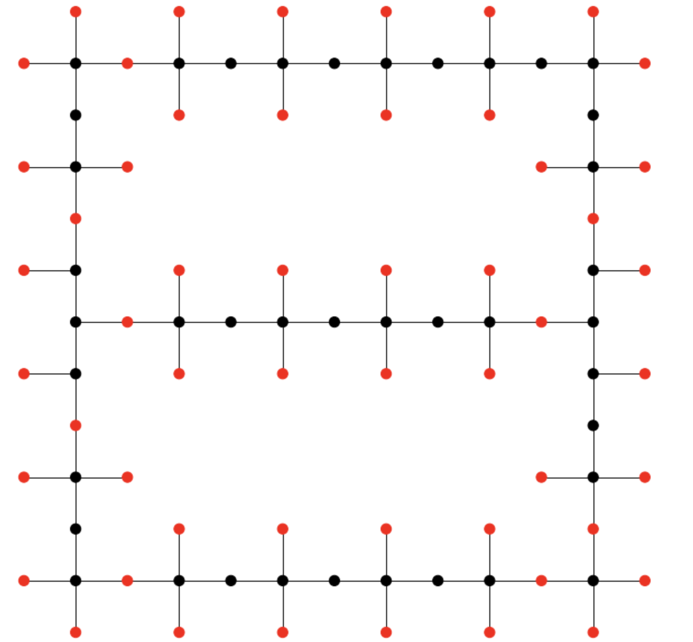

#Hi! We are the IsaacChuangFansClub team!

---

# MIS problem evolved

# Problem

An analog Hamiltonian simulation computer solves this problem by trying to be in the lowest energy state.

# Approach 

## Graph design
On the picture below one can find the graph structure we have used in the challenge in order to maximize the number of independent sets. The way the pattern is created is by multiplying the building block element depicted in the next figure. 

### Other graphs we've looked into

## Blockade radius optimization

## Pulse Optimization

### References

[1] **Minimizing irreversible losses in quantum systems by local counterdiabatic driving**

# Results
The result of running the demonstration algorithm with the enhanced parameters is presented below.

|Variable|Quantity|
|:----|----:|
|Nshots|80|
|Number of independent sets|51|
|Total number of nodes|93|

{width=60%}

{width=60%}
