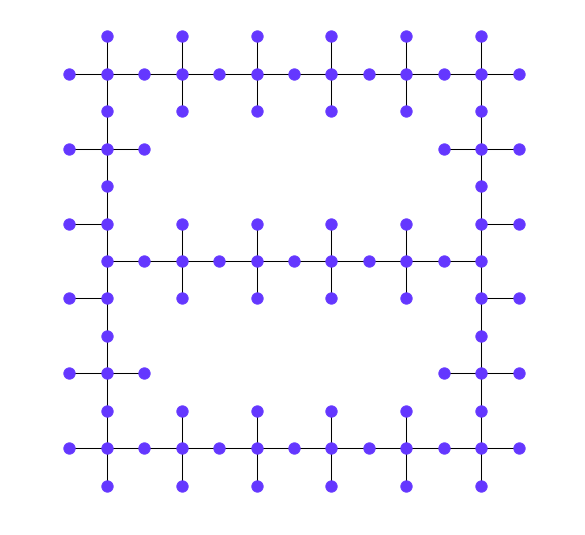
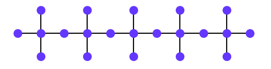
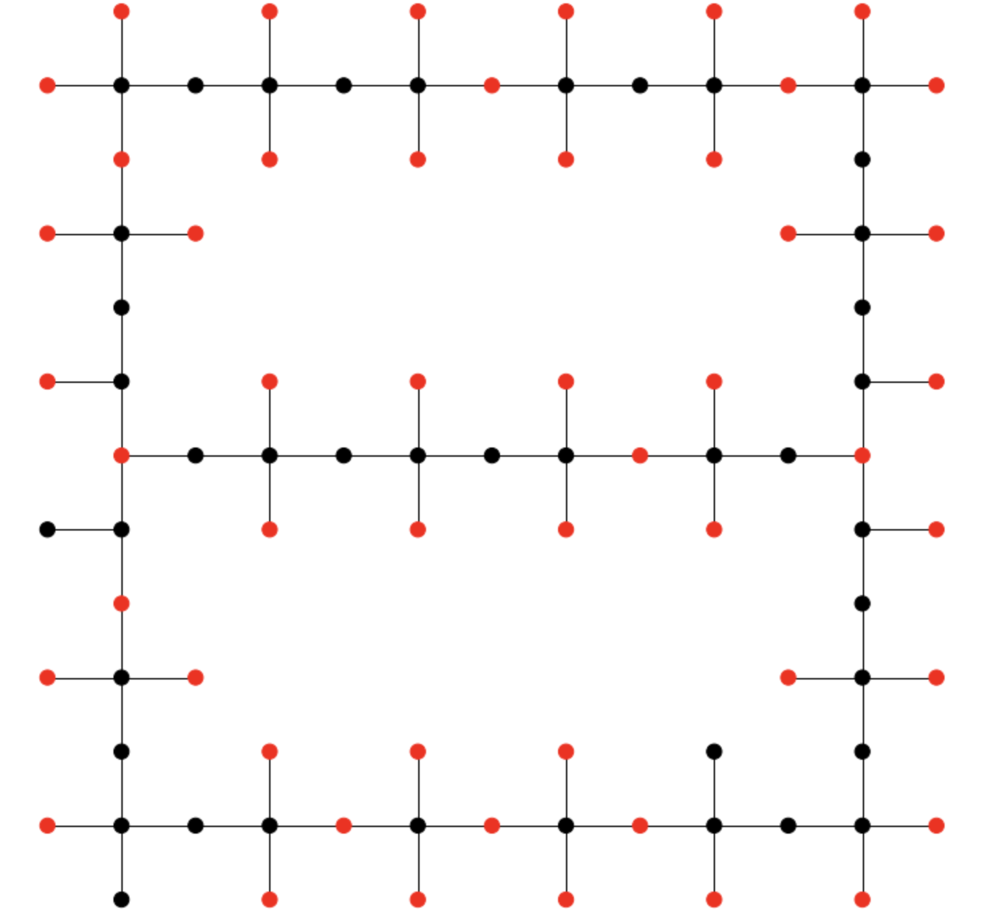
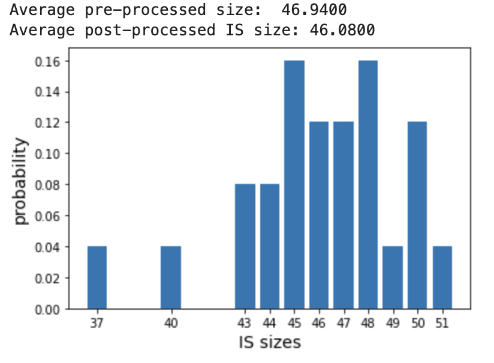

# Hi! We are the IsaacChuangFansClub team!

---

# Problem

Find Maximum Independent State of graphs that constructed by repetition of small 3*N graphs (like the one we used) while trying to be in the lowest energy state.

# Approach 

The idea we used in the challenge was to encode the MIS solution into the ground state of Hamiltonian. Next, we used the quantum adiabatic algorithm (QAA), Rydberg blockade, to evolve simple Hamiltonian to desired complicated Hamiltonian. The issue we experienced that the points betweeen the intersetion was under the influence of 4 sources of energy, which in often cases resulted that they were in grounded state, when needed to get in Rydberg state. We solved this isssue by calculating more optimal parameters for our graph. In particular, we increased the delta_final value whichi resulted in a smaller Blockade Radius. Our team used Cubic Spline transformation which made amplitude and detuning values change smoothier over the time which increased the accuracy. At the end, we used these values in Adionbatic annealing algorithm which increased delta value from negative to positive and mixed various states of vertices transforming the ones we need from 0 to 1. 

## Graph design
On the picture below one can find the graph structure we have used in the challenge in order to maximize the number of independent sets. The way the pattern is created is by multiplying the building block element depicted in the next figure. 

### Other graphs we've looked into

## Blockade radius optimization

## Pulse Optimization

# Results
## Best result
The best result of running the demo algorithm with the enhanced parameters is presented below. Using it, we gain 53 nodes in the maximum independent set with some probability which is depicted below in the bars graph. A graph illustrating the omega function is provided as well.

|Variable|Quantity|
|:----|----:|
|Nshots|100|
|Maximum number of independent set|53|
|Total number of nodes|93|
|Delta_final|35 Mrad/s|

{width=60%}

{width=60%}

{width=60%}

## Other results

However, the probability distribution of the 53 excited nodes is not ideal, so now we also add some examples of smaller MIS, but with higher concentration in the larger MIS values.

{width=60%}

{width=60%}

|Variable|Quantity|
|:----|----:|
|Nshots|50|
|Maximum number of independent set|51|
|Total number of nodes|93|
|Delta_final|35 Mrad/s|

{width=60%}

You can find our slides **[here](https://docs.google.com/presentation/d/1wDG__AXQAmi6gGfz51vwd4McepYewIAuku8Dp_C0dVg/edit?usp=sharing)**.
